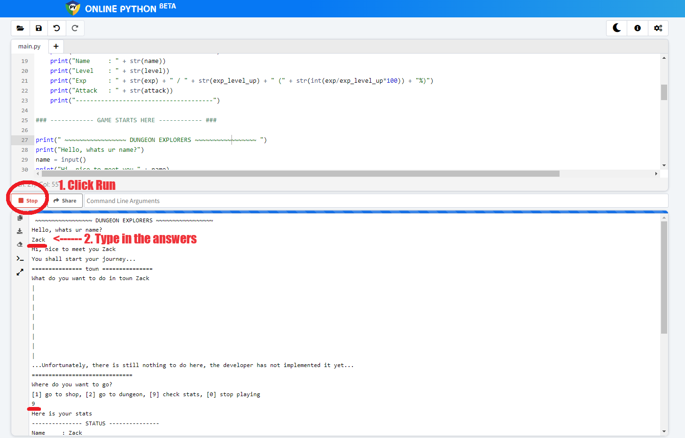

# DUNGEON EXPLORERS
> a simple python text based game

This game is made to give a very simple and quick glimps into programming, using python. This is actually my personal way when I first learned how to program.

## Getting Started
- open [online-python.com](https://www.online-python.com/) (online python interpreter)
- open [simply_game.py](simple_game.py)
- copy all the contents from [simply_game.py](simple_game.py) to [online-python.com](https://www.online-python.com/)
- click run
- start following the instructions in the console

- try edit and fiddle around with the code, understand how the logic flows and works!
    - idea: implement a dialog when going to shop, or towns!
    - idea: create money and inventory to be able to buy from the shops! add your attack stats when equiping a weapon!
    - idea: create a system to encounter and fight against monsters when in dungeon! then gain exp and level up!
- after you are more used to the code, checkout [game.py](game.py) and [player.py](player.py) to learn a little bit about modules and Object-Oriented Programming
- make your own game, have fun!